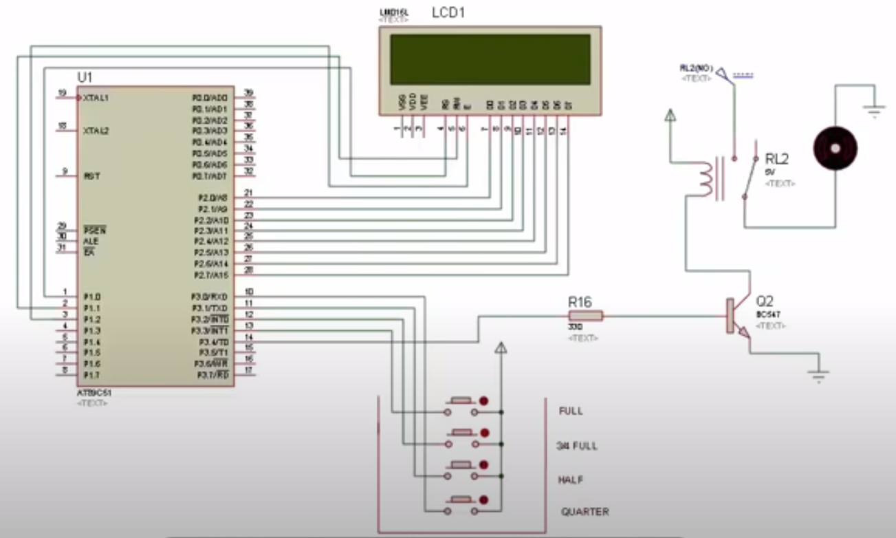

# MINI TASK - 1

## 1. KEYBOARD USING SMD SENSORS:

Link: https://www.instructables.com/id/Velocity-Sensitive-Cardboard-Keyboard/

In this project, a small keyboard is made using cardboard. The cardboard is cut into various small pieces which corresponds to various keys in the keyboard. The various pieces are joined using hot silicone. There are 5 keys which correspond to C,D,E,F,G frequencies and is fitted into a larger cardboard using rubber straps, and there are slots made for inserting them onto the base. SMD sensors are used to detect which key is being pressed, and is therefore fitted below each key of the keyboard. The sensors are connected to 5 analog pins of an Ardunio Mega and is coded using the toneAC library such that sound of the corresponding frequency comes when that particular key is pressed. In this way, this project was implemented.

## 2. AUTOMATIC WATER LEVEL CONTROLLER:

Link: https://www.electronicshub.org/water-level-controller-using-8051-microcontroller/

In this project, the level of the water is automatically controlled using the 8051 microcontroller which is programmed using the Keil uVision IDE. The aim of this project is to control the water in the tank such that the motor stops running automatically when the tank is full and it starts running when the tank is empty. This reduces human intervention as well as water losses due to water overflowing from the tank. This is based on the principle that water conducts electricity. Wires are connected to different levels of water - either LOW, MEDIUM, HIGH or QUARTER full, HALF full,... There is an LCD display as well which denotes the level of water present in the tank, just in case if someone wants to know the level of water. If initially the tank is empty, the motor starts running, and when the water at appropriate levels are reached, the LCD displays the appropriate level of water. When the tank is full, the motor is automatically switched off. When the water tank is on the EMPTY level, the motor gets turned on automatically, to refill the water in the tank. The display on the LED and the motor is controlled by the 8051 microcontroller.

## 3. BIDIRECTIONAL VISITOR COUNTER:

Link: https://www.electronicshub.org/bidirectional-visitor-counter-using-8051-microcontroller/

The aim of this project is to display the number of visitors who are currently present in a room by sensing the entry and exit of people at the entrance. It is displayed on an LCD display which is controlled by an 8051 microcontroller. There are two IR sensors which are controlled by the microcontroller and they sense movement of people entering or exiting the room. How the sensors do this can be easily explained. Let us call the sensors, sensor 1 and sensor 2 such that sensor 2 is inside the room and sensor 1 is near the entrance. When there is some movement sensed by sensor 1 and then at sensor 2, it means that the person has entered the room and the count in the LCD goes up by 1. Rather, if there is some movement sensed by sensor 2 and then at sensor 1, then the person has left the room and hence the count in the LCD decreases by 1.

## 4. REAL TIME CLOCK (RTC) USING ARDUINO:

Link: https://www.electronicshub.org/arduino-real-time-clock-tutorial/

This project implements a real time clock (RTC) by interfacing an RTC IC onto an Arduino. Here, the RTC IC used is DS1307, which has some really cool features. It has information about the complete date and time (i.e.) hours, minutes, seconds, year, month, date and day of the week. It consumes really really low power as it draws only 500nA when connected to a battery. It is connected to an Arduino and the Arduino is connected to an LCD display, which displays the complete date and time. This is done by using the libraries LiquidCrystal.h (for writing onto the LED) and RTClib.h (for getting information from the RTC IC).

## 5. RGB LED MATRIX:

Link: https://www.electronicshub.org/diy-rgb-led-matrix/

This project aims to create an RGB LED matrix which is to be controlled by a mobile app designed specifically for this purpose. This LED matrix consists of 8 rows and 6 columns. Each row contains red, green and blue LEDs which are cut from an LED strip. Each set of R,G and B LEDs are cut and pasted on a panel. Holes are drilled through the metal contacts in order to make connections. Further, an IC 74HC595N is used, which is actually an 8-bit serial-in, serial or parallel-out shift register, which gets serial input from the Arduino and converts it to parallel output which can be fed to the LEDs. Transistors are used, one for each colour of LEDs to drive them. The circuit is then done on a PCB. Entire control of the LED matrix is done by the app (MIT App inventor 2).

## 6. FACE MASKS DISINFECTION DEVICE:

Link: https://www.hackster.io/needlab/face-masks-disinfection-device-needlab-3ed2f5

Devices such as this are the need of the hour due to the ongoing pandemic. Protective equpments such as masks won't be available in penty all the time and hence, there is a need for disinfecting them so that it can be reused again and it minimises the risk of the user getting infected. In this device, disinfection is done using UV radiations coming from a 11W UV-C source. In order to generate higher temperatures, the UV light generated is reflected by an aluminium foil and since it is a closed surface, the light gets trapped. The face mask is placed on a wire rack designed within the box. Arduino is used as an interface for the temperature sensor so that the temperature inside the enclosure can be displayed. Also there is a provision that if the temperature goes too low or too high, then an alarm rings.

## 7. ESP-01 BASED SONOFF SWITCH CONTROLLER:

Link: https://www.hackster.io/rizwan946/esp-01-based-sonoff-wireless-smart-switch-457046

A sonoff switch is a WiFi based switch controller which help us to remotely control any electrical appliance from anywhere. In this project, a WiFi module called ESP-01 is interfaced with Arduino. It is coded using the WIFiManager library in Arduino.

## 8. BLUETOOTH CONTROLLED ROBOTIC CAR:

Link: https://www.hackster.io/ashshaks/bluetooth-control-robotic-car-0d9444

In this project, a car which is controlled by bluetooth is designed using HC-05 bluetooth module interfaced on an Arduino. There is a specific app required to be downloaded in the Android phone and this is used as a transmitting device. The bluetooth module placed in the car is the receiver. The app contains controls for the car to move in all the four directions.

## 9. CONTACTLESS HAND WASH TIMER:

Link: https://www.hackster.io/akshayjoseph666/covid-19-touchless-hand-wash-timer-e2ea56

This project is also the need of hte hour due to the ongoing COVID-19 pandemic as washing hands for a minimum of 20 secs is really necessary to prevent the spread of the virus. But how to ensure that the time is maintained? Well, use a servo motor which takes 20 seconds to turn by 180 degrees and stop the flow of water when the motor has turned by 180 degrees. An Arduino is used to control the motion of the motor. Distance sensor is use to detect the presence of hand and if the hand is present, then the motor begins to rotate as mentioned before.

## 10. ARDUINO BASED INTEGRATED SECURITY SYSTEM:

Link: https://www.projectsof8051.com/iot-based-home-security-system-using-arduino/

This is a security system which is to be installed at home in order to prevent (or at least warn us about) various mishaps like fire, LPG gas leakage and theft. The first two are prevented by specific sensors like LPG snesors and smoke sensors. Theft is prevented by using a numeric keypad at the entrance. The door is modelled as a DC motor in this project. If there is any mishap which is about to happen, a buzzer will go off. The entire system is monitored by an Arduino using ESP8266 WiFi module.

## 11. IOT BASED CAR PARKING SYSTEM:

Link: https://www.projectsof8051.com/iot-based-car-parking-system/

In this project, a miniature car parking system consisting of 4 parking slots is to be monitored. IR sensors are fitted at the entry, exit and at each of the 4 slots. When a car enters, the corresponding IR sensor detects it and opens the entrance gate by moving the designated DC motor. A similar thing happens when a car is planning to exit. For each parking slot, the correspondng IR sensor detects the presence of car in that slot and displays the information on the LCD display present at the entrance, whether the particular slot is empty or full. This information is transmitted to the LED via the ESP8266 module. 

## 12. BLUETOOTH CONTROLLED ROBOT:

Link: https://www.projectsof8051.com/bluetooth-controlled-robot-using-android-mobile/

In this project, a robot is controlled using a mobile app which connects with the robot via Bluetooth. The control is such that there are keypads from 1 to 9 in the app, and by pressing different keys, the robot moves in the corresponding sirection (2-forward, 8-backward,...) This is controlled using an 89s51 microcontroller programmed using Assembly language.

## 13. ARDUINO BASED GREENHOUSE:

Link: https://www.instructables.com/id/Awesome-Greenhouse-With-Automatic-Watering-Interne/

This is a Greenhouse controlled by Arduino which has, among many other features, a DGT11 sensor for meauring air temperature and humidity. It also has an internet control to send an e-mail when teh tank is empty. The project uses ENC28J60 internet module simply because it was way cheaper, but it didn't work out well. I personally had some terrible experiences with cheaper modules as well. It uses Blynk to code, rather than Arduino IDE.

## 14. 3D PRINTER FILAMENT COUNTING:

Link: https://www.instructables.com/id/Smart-3D-Printer-Filament-Counter/

Here, the length of the filament used to print in a 3D printer is computed using a rotary encoder. The filament is held against a pulley to convert the linear motion of the filament into rotational motion to be detected by the rotary encoder. The project also does more interesting stuff as well, such as sending notifications to the phone about the time of start of printing and stopping. In order to push notifs to phone, an app called Prowl IOS app is used.

## 15. ARDUINO DISTANCE DETECTOR:

Link: https://www.instructables.com/id/Arduino-Distance-Detector-with-a-Buzzer-and-LEDs/

This is a distance detector equipped with buzzer and LEDs such that when the nearest object sensed by the ultrasonic sensor(HC-SR04) comes closer and closer, more LEDs will light up and the sound coming from the buzzer will be louder. There are 2 LEDs each of red, yellow and green attached to different pins of Arduino. And there is a buzzer attached to it as well. The important learning here is that wherever possible, use a resistor for LEDs as well as the buzzer.

## 16. CONTROLLING A ROBOT USING OUR MIND:

Link: https://hackster.io/Jose_Romani/moving-a-robot-with-the-help-of-your-mind-6b399d

This is a project in which a robotic car can be controlled using the attention of the mind. This uses the EEG of the brain in order to capture it and sends the information to the car via a Bluetooth module. The speed of the car increases as the attention increases. This way of controlling the car using our brain sounds really exciting for me.

## 17. WIFI-BASED REAL TIME COVID-19 TRACKER:

Link: https://www.hackster.io/niyazthalappil/covid-19-real-time-data-monitor-7b43e5

The live data for COVID-19 (total no. of cases. no. of deaths, and no. of people recovered) are tracked in this project. A small portable device called M5StickC is used, which uses ESP32, and thus has in-built WiFi connection. Using this Wi-Fi, data is collected from the relevant website and is displayed on the Stick. An in-built battery level tracker is also added as a feature, as it has an in-built battery.

## 18. FINGERPRINT LOCK:

Link: https://www.hackster.io/electronicprojects/arduino-fingerprint-security-lock-c4e5b3

This is a fingerprint sensor designed for security purposes. This circuit is designed so that a door lock is opened when the correct fingerprint is detected. This uses the Adafruit r307 fingerprint sensor.

## 19. BATTERIES FROM PENNIES:

Link: https://www.instructables.com/id/How-to-Turn-Spare-Pocket-Change-into-DIY-Batteries/

In this project, the Zinc which is the major component for many pennies, is modified appropriately such that all the other materials are removed (by using sandpaper, vinegar etc.) and what remains is pure Zinc. Each penny has a voltage of about 0.6V and appropriate number of pennies can be stacked up as per our voltage requirements.

## 20. DC MOTOR CONTROLLER:

Link: https://www.instructables.com/id/Easy-DC-Motor-Controller/

This is a circuit which controls the direction of DC motor using a microcontroller with BJT and n-MOS transistors as switches controlling the direction of rotation. There are diodes connected so that high surges in voltage are prevented.

## 21. PORTABLE SOLAR CHARGER:

Link: https://www.instructables.com/id/portable-Solar-Charged-USB-charger/

Here, a portable solar charged USB charger is made, with the main idea of being able to charge any device during long trips, as sunlight is available, but we may not have access to electricity. A miniature solar cell acts as a power source and it is converted to a required voltage using DC-DC converter. A voltage regulator is there so that the voltage required is just the right amount.It is then available for connection to any device after going through a couple of resistor dividers.

## 22. ALCOHOL DETECTOR AND ENGINE LOCKING SYSTEM:

Link: https://www.projectsof8051.com/gps-tracker-and-alcohol-detector-with-engine-locking-system-using-gsm/

This project deals with the contemporary problem of drunken driving. Using an alcohol sensor, whether the driver is drunk or not is detected. If the alcohol level is above a particular value, a buzzer goes off and it will be impossible to start the engine. There is an LCD which displays the alcohol content. Using GPS and GSM, the exact position of the vehicle will be sent to the owner of the vehicle for further actions to be taken.

## 23. STOCK EMPTY OR FULL DETECTOR:

Link: https://www.projectsof8051.com/gsm-based-stock-empty-or-full-indicator-using-weight-sensor/

In this project, a weight sensor is interfaced with a 8051 microcontroller. This detects whether the stock is empty or full using a weight sensor. A LED display is used to display the weight and whether the weight is accpetable or not. If the weight falls out of range, then a GSM module is used to send a message to a phone.

## 24. VOICE CONTROLLED ROBOT:

Link: https://www.projectsof8051.com/voice-controlled-robot/

In this project, the robot is controlled by an Android mobile phone that connects to the Bluetooth decoder attached to the robot. The robot is controlled by voice which is decoded by a mobile app and the motor is controlled by a bluetooth signal. Bluetooth decoder is always connected to Robot. This robotic vehicle operated on 7 commands like forward, reverse, left, right, stop, left U-turn, right U-turn. 

## 25. RFID BASED ATTENDANCE SYSTEM:

Link: https://www.projectsof8051.com/rfid-based-attendance-system-with-sms-indication-using-gsm-modem/

Here, every person, whether a student (if the attendance is taken at a school or college) or an employee (in an office) is given a RFID card and RFID reader is placed at designated places. A buzzer will be turned on when an invalid card is shown to the RFID reader. A GSM modem is used to send a SMS whether a particular person is present or not. 
